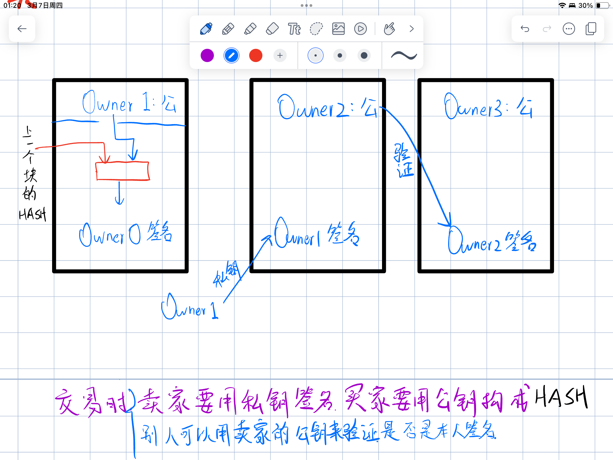
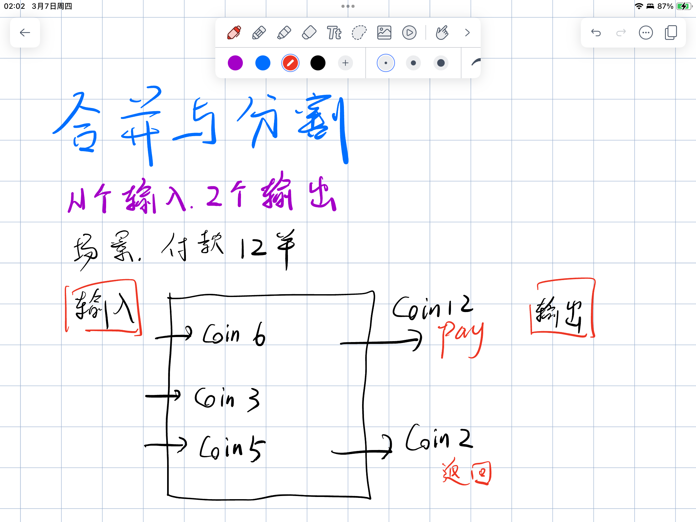

# 第一天

- 金融机构的交易存在仲裁的可能，因此某些交易额度大交易成本（包括仲裁可能性和成本）的交易被杜绝。同时为了降低成本，交易双方需要提供更多冗余信息来使得交易更加可信。链下世界的信任成本太大！
- 比特币系统是一种证明方案，来保证交易不可撤销，降低信任成本，达成这一点之需要多数CPU是善良的即可。
- 一笔交易的原理
- 工作量证明采用CPU算力而不是IP投票
- 对于节点，只要用上一个区块哈希作为新区块的上一个哈希值，就证明对上一个区块的接受
- 每个块的第一笔交易是给矿工的赏金
- 攻击者诚信：有能力攻击而去攻击，则丧失诚信，币不值钱；有能力攻击而不攻击，则能获得代币，还值钱
- 10min一个区块，每个区块头80bytes（其余交易可以对根hash进行修剪而取掉），每年数据增长4.2MB
- 简化支付验证：
    1. 计算待验证支付的交易哈希值；
    2. 节点从区块链网络上获取并存储最长链的所有区块头至本地；
    3. 节点从区块链获取待验证支付对应的默克尔树哈希认证路径；（这里找到了该交易对应的哈希值）
    4. 根据哈希认证路径，计算默克尔树的根哈希值，将计算结果与本地区块头中的默克尔树的根哈希值进行比较，定位到包含待验证支付的区块；（找到这个哈希值属于哪个区块）
    5. 根据该区块头所处的位置，验证该区块的区块头是否已经包含在已知最长链中，确定该支付已经得到的确认数量，如果包含则证明支付真实有效。（证明本交易得到了6次确认）
    6. 可能存在的隐私泄露风险用bloom过滤器解决（模糊查找的数据，判定存在不一定存在，但不存在一定不存在）
- [区块链知识讲解：SPV简单支付验证](https://www.woshipm.com/blockchain/1027209.html)
- 合并与分割