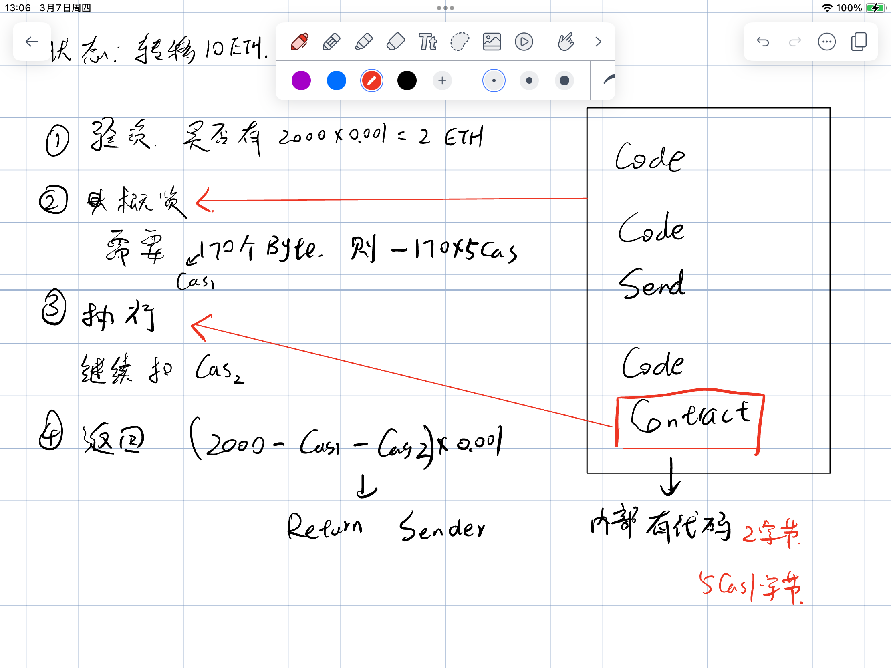

# ETH 白皮书

## 参考资料
https://github.com/ethereum/wiki/wiki/%5B%E4%B8%AD%E6%96%87%5D-%E4%BB%A5%E5%A4%AA%E5%9D%8A%E7%99%BD%E7%9A%AE%E4%B9%A6

## 笔记
- [Byzantine Fault Tolerance](https://www.fool.com/terms/b/byzantine-fault-tolerance/)
- 比特币的状态转换
  - 交易的每个输入：如果引用的UTXO不存在于现在的状态中（S），返回错误提示（看系统中是否存储了这个coin的相关信息）
  - 如果签名与UTXO所有者的签名不一致，返回错误提示（看这个coin是不是发送的所拥有的coin）
  - 如果所有的UTXO输入面值总额小于所有的UTXO输出面值总额，返回错误提示（看这个交易是否合理合法，输出同时包含给自己的找零）
  - 返回新状态S’,新状态S’中移除了所有的输入UTXO，增加了所有的输出UTXO。（全部满足则变更新的状态，UTXO）
  - 状态处理函数
  - 预测用oracle或谢林点
  - 幽灵协议就是叔父区块
  - 以太坊使用基于1000个随机数产生的局部函数的挖矿算法